### Escuela Colombiana de Ingeniería
### Arquitecturas de Software - ARSW

## Escalamiento en Azure con Maquinas Virtuales, Sacale Sets y Service Plans

### Dependencias
* Creé una cuenta gratuita dentro de Azure. Para hacerlo puede guiarse de esta [documentación](https://azure.microsoft.com/es-es/free/students/).
  
Documentacion sobre las azure functions : [Azure Functions](https://www.c-sharpcorner.com/article/an-overview-of-azure-functions/)

### Parte 0 - Entendiendo el escenario de calidad

Adjunto a este repositorio se encuentra una aplicación totalmente desarrollada que tiene como objetivo calcular el enésimo valor de la secuencia de Fibonnaci.

**Escalabilidad**
Cuando un conjunto de usuarios consulta un enésimo número (superior a 1000000) de la secuencia de Fibonacci de forma concurrente y el sistema se encuentra bajo condiciones normales de operación, todas las peticiones deben ser respondidas y el consumo de CPU del sistema no puede superar el 70%.

### Escalabilidad Serverless (Functions)

En esta parte del laboratorio se construyo, desplego y probo las Azure Functions de Fibonacci. Primero trabajé con la versión inicial y luego añadí la versión recursiva con memoization para comparar su comportamiento en ejecución y después de un tiempo de inactividad.

1. Creé la Function App en Azure desde Visual Studio Code y verifiqué que el proyecto quedara asociado al recurso correcto.

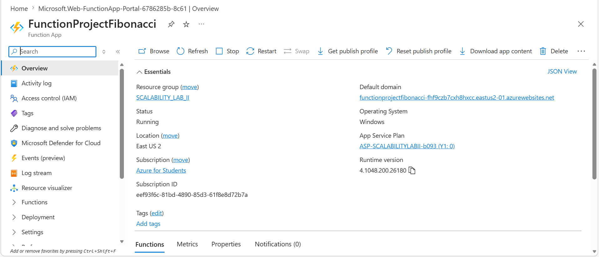

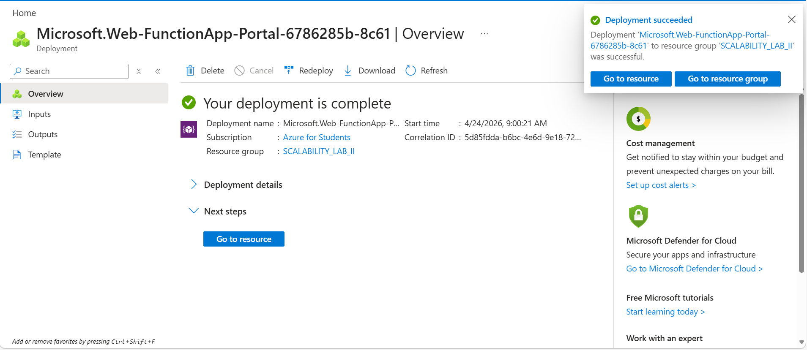

En este primer paso dejé listo el contenedor principal donde se van a ejecutar las Functions del laboratorio.

2. Instalé la extensión de **Azure Functions** en Visual Studio Code para poder crear, ejecutar y desplegar las Functions desde el editor.

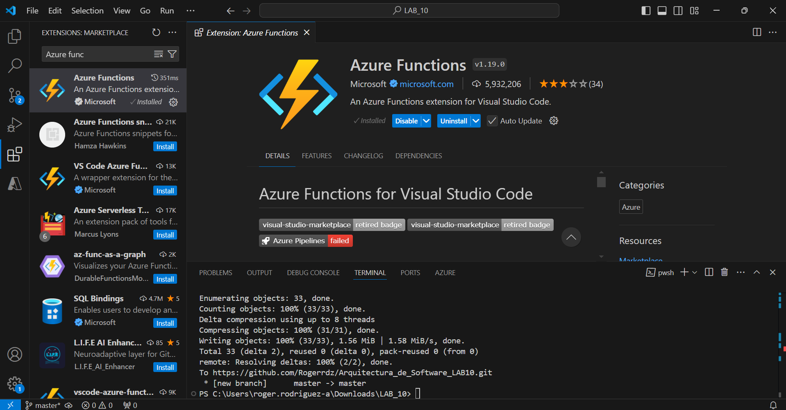

Con esto pude trabajar directamente sobre el proyecto local sin salir de VS Code.

3. Desplegué la Function de Fibonacci a Azure usando Visual Studio Code. La primera vez tuve que iniciar sesión y autorizar el acceso, y después confirmé que el despliegue terminara correctamente.

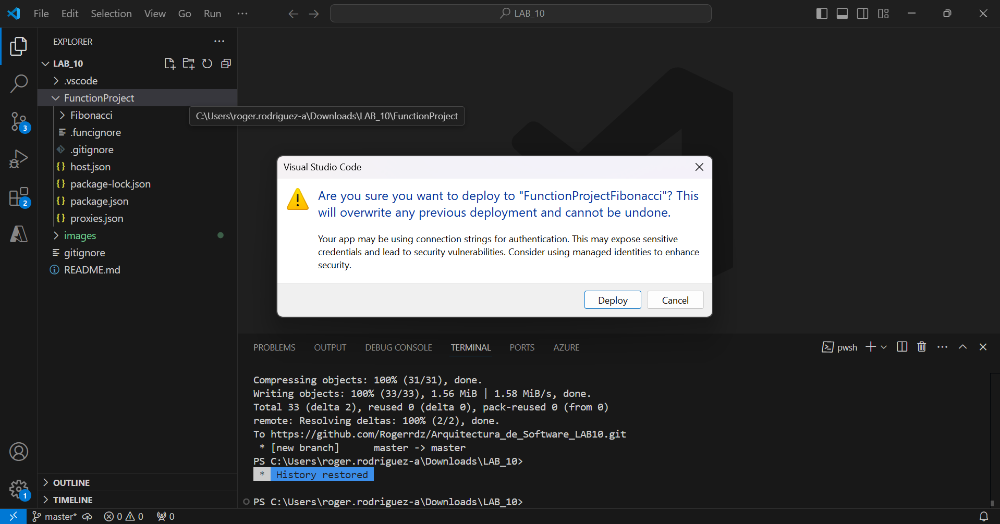

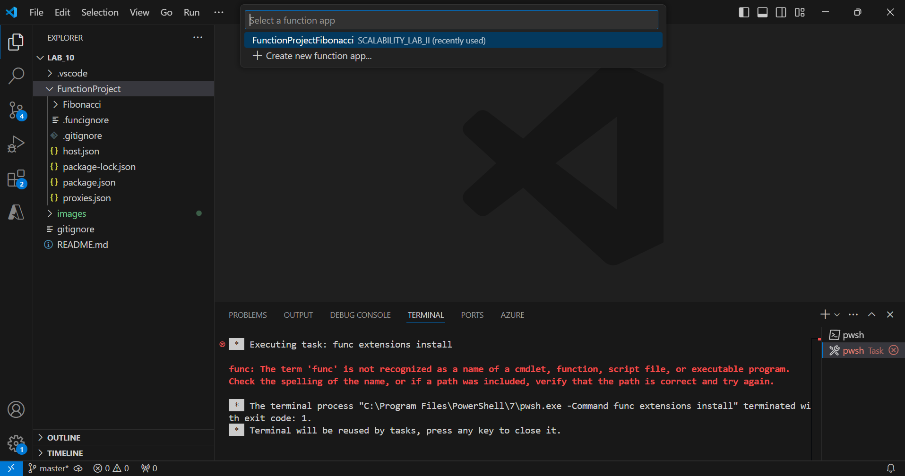

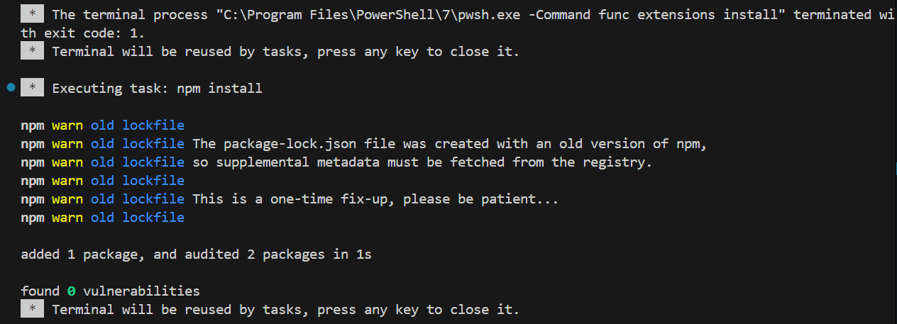

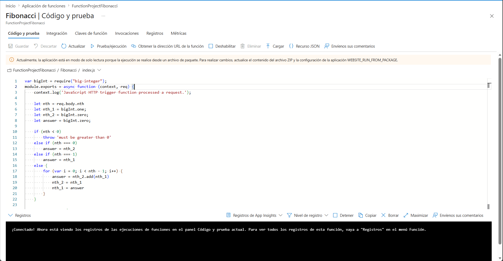

En este punto ya tenía la Function publicada y disponible para pruebas desde Azure.

4. Yo probé la Function desde el portal de Azure para confirmar que respondiera correctamente con un valor válido de `nth`.

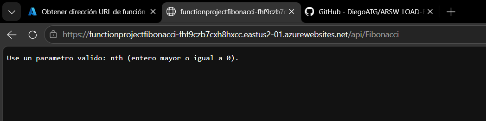

Esta prueba me sirvió para validar que el endpoint estaba funcionando antes de hacer cambios más específicos.

5. Modifiqué la colección de POSTMAN con NEWMAN para enviar 10 peticiones concurrentes y revisar el comportamiento bajo carga , esto mediante el siguiente script.

```powershell
$uri = "https://functionprojectfibonacci-fhf9czb7cxh8hxcc.eastus2-01.azurewebsites.net/api/Fibonacci"
$body = '{"nth":45}'

$jobs = 1..10 | ForEach-Object {
  $id = $_
  Start-Job -ScriptBlock {
    param($u, $b, $i)
    try {
      $sw = [System.Diagnostics.Stopwatch]::StartNew()
      $resp = Invoke-RestMethod -Method Post -Uri $u -ContentType "application/json" -Body $b
      $sw.Stop()
      [PSCustomObject]@{
        request = $i
        ok      = $true
        ms      = $sw.ElapsedMilliseconds
        result  = $resp
      }
    } catch {
      [PSCustomObject]@{
        request = $i
        ok      = $false
        ms      = $null
        result  = $_.Exception.Message
      }
    }
  } -ArgumentList $uri, $body, $id
}

$results = $jobs | Receive-Job -Wait -AutoRemoveJob
$results | Sort-Object request | Format-Table -AutoSize
"Exitosas: $((($results | Where-Object ok).Count)) / 10"
```

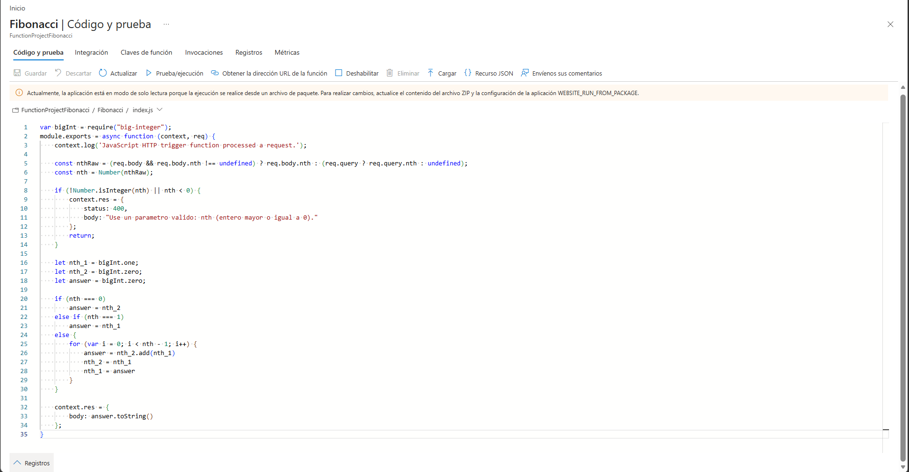


En las pruebas vi que la función respondía a todas las solicitudes, aunque el tiempo de respuesta dependía de la carga y del tipo de cálculo que estuviera haciendo.

6. Creé una nueva Function de Fibonacci con un enfoque recursivo y memoization. La probé varias veces con los mismos valores, esperé al menos 5 minutos sin usarla y luego volví a probarla.

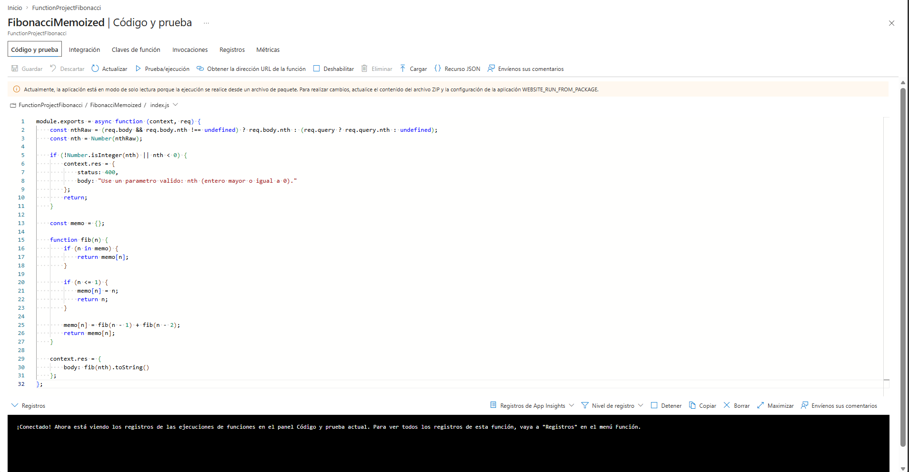

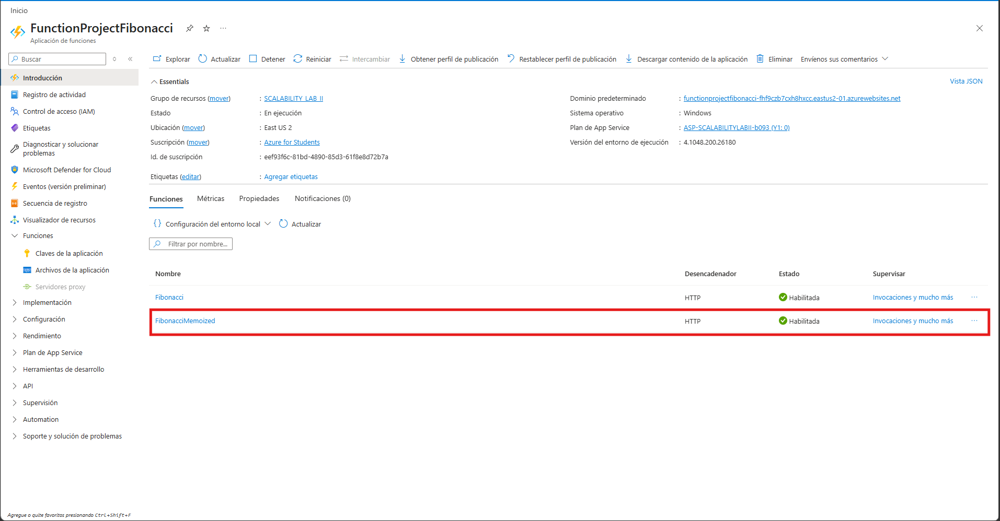

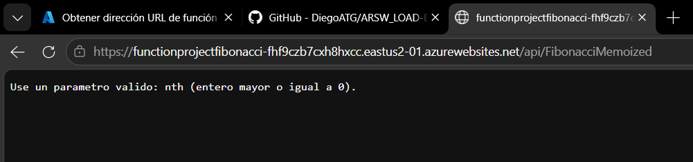

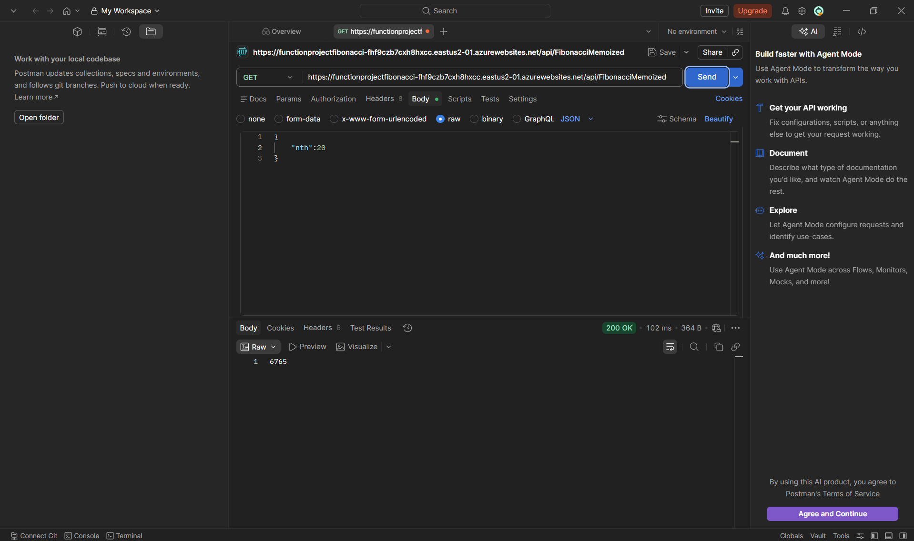

Para documentar la mejora de tiempo en la función recursiva, hice varias pruebas consecutivas con el mismo valor de `nth` y guardé las capturas de las respuestas. En las primeras ejecuciones el tiempo fue mayor, pero en las siguientes se notó una reducción clara porque los resultados ya estaban almacenados en memoria.


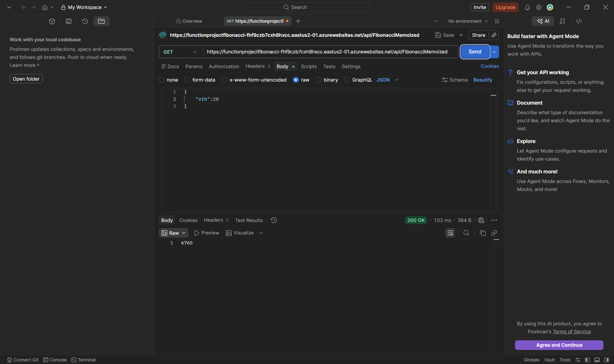


Mientras la instancia permaneció activa, noté que las consultas repetidas se resolvían más rápidas porque la memoria conservaba los resultados calculados. Después del tiempo de inactividad, la instancia pudo reciclarse y la caché de memoization se perdió, así que la Function volvia a calcular los valores desde cero.

**Preguntas**

* ¿Qué es un Azure Function?

Un Azure Function es un servicio de computación serverless de Azure que ejecuta código bajo demanda sin que yo tenga que administrar servidores. Yo despliego la lógica y Azure se encarga de ejecutarla cuando llega una petición o un evento.

* ¿Qué es serverless?

Serverless no significa que no existan servidores, sino que yo no los administro directamente. La plataforma se encarga del aprovisionamiento, el escalado, la disponibilidad y el mantenimiento, y yo me concentro en la lógica de negocio.

* ¿Qué es el runtime y que implica seleccionarlo al momento de crear el Function App?
  
El runtime es el entorno de ejecución que usa Azure Functions para correr el código, por ejemplo Node.js, .NET o Python. Al seleccionarlo, yo defino qué lenguaje, versión y modelo de ejecución va a soportar la Function App, y eso afecta compatibilidad, despliegue y comportamiento.


* ¿Por qué es necesario crear un Storage Account de la mano de un Function App?

El Storage Account es necesario porque Azure Functions lo usa para guardar información interna del funcionamiento de la app, como logs, checkpoints, estado de triggers y datos temporales. También hace parte del soporte que necesita el host de Functions para operar correctamente.

* ¿Cuáles son los tipos de planes para un Function App?, ¿En qué se diferencias?, mencione ventajas y desventajas de cada uno de ellos.

Los principales planes para una Function App son Consumption, Premium y App Service Plan. Consumption escala automáticamente y se paga por ejecución, así que es ideal para cargas intermitentes, aunque puede presentar cold start. Premium también escala automáticamente, reduce o evita cold start y ofrece más control, pero es más costoso. App Service Plan corre sobre capacidad reservada, da más control y puede aprovechar infraestructura ya existente, pero no escala con la misma flexibilidad que Consumption.

* ¿Por qué la memoization falla o no funciona de forma correcta?

La memoization falla o deja de verse útil porque la caché vive en memoria de la instancia donde se ejecuta la función. En Azure Functions esa instancia puede reciclarse, apagarse o cambiar por el modelo serverless, así que la caché se pierde y la función vuelve a calcular los valores desde cero.

* ¿Cómo funciona el sistema de facturación de las Function App?

El sistema de facturación depende del plan. En Consumption normalmente se cobra por número de ejecuciones y por recursos consumidos, como el tiempo de ejecución y la memoria. En Premium y App Service Plan el costo está más ligado a la capacidad reservada o a la instancia activa que al número de invocaciones.

* Informe

**Objetivo**

El objetivo de esta parte fue evaluar el comportamiento de la Function de Fibonacci bajo concurrencia, realizando 10 peticiones simultáneas con Newman para observar su capacidad de respuesta y verificar si atendía correctamente varias solicitudes al mismo tiempo.

**Metodología**

Para esta prueba modifiqué la colección de Postman y la ejecuté con Newman, de forma que se enviaran 10 peticiones concurrentes a la Function. Luego revisé las respuestas obtenidas, el tiempo de ejecución de cada solicitud y si existían errores o fallos en la atención de las peticiones.

**Resultados**

Durante la ejecución de la prueba, la Function respondió correctamente a las solicitudes enviadas. Observé que todas las peticiones fueron atendidas, aunque el tiempo de respuesta no fue exactamente igual en cada caso, ya que dependió de la carga de ejecución y del cálculo solicitado. Esto permitió ver que el servicio soporta concurrencia, pero que su desempeño puede variar según el número de solicitudes simultáneas.

**Conclusión**

Con esta prueba pude comprobar que la Function de Fibonacci es capaz de responder a varias solicitudes concurrentes, lo que confirma su funcionamiento en un escenario de carga básica. Sin embargo, también evidencié que el tiempo de respuesta puede aumentar cuando se ejecutan varias peticiones al mismo tiempo, por lo que el rendimiento depende del nivel de concurrencia y de la complejidad del cálculo.

**Evidencia**

A continuación dejo las capturas que soportan el desarrollo y las pruebas realizadas:


  